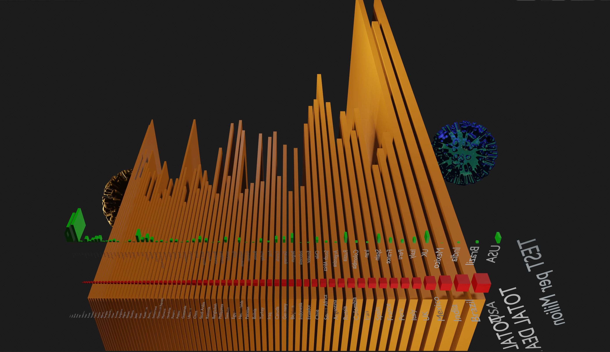
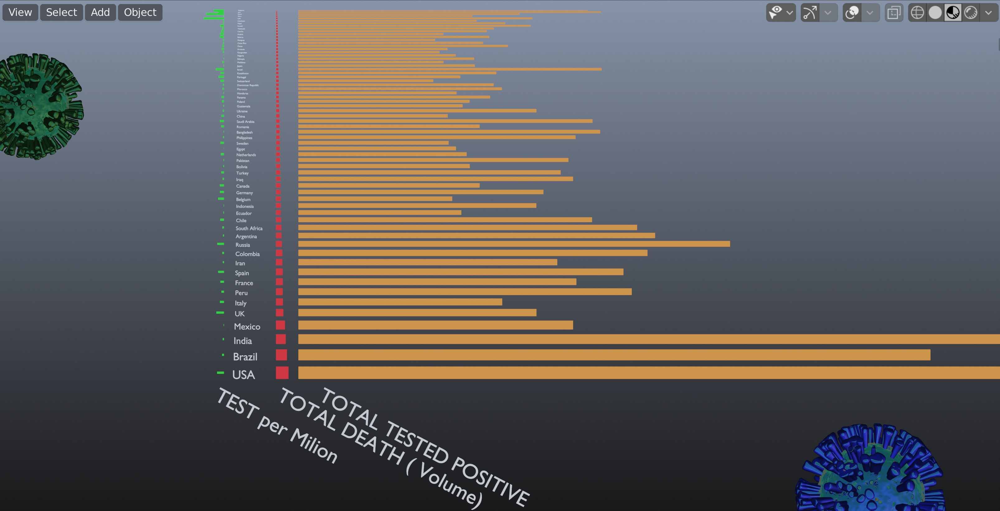
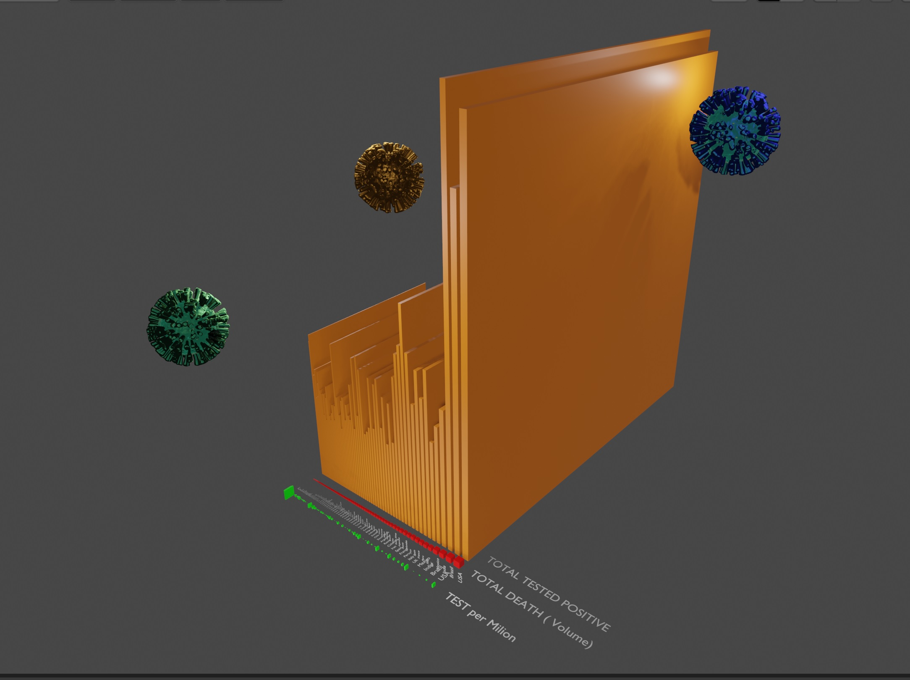

# Covid-19-3D-Data-Visualization
3D Data visualization by Python and Blender of the virus world impact 

Red:    total death            (rapresented as Volumes of the objects)

Orange: tolat tested positive  (rapresented as Volumes of the objects)

Green : Tested / 1 Milion

65 most impacted #nations.

Data source : https://www.worldometers.info/coronavirus/ ( exported in Exel - I am going to implement web scraping service ) 

